# React Tutorial

作成日：2020/02/14

## Reactってなに？？

- ユーザインターフェース構築のためのJavaScriptライブラリ

### 宣言的な View
- Reactは、インタラクティブなユーザインターフェイスの作成にともなう苦痛を取り除きます．アプリケーションの各状態に対応するシンプルなViewを設計するだけで，Reactはデータの変更を検知し，関連するコンポーネントだけを効率的に更新，描画します．
- 宣言的なViewを用いてアプリケーションを構築することで，コードはより見通しが立ちやすく，デバッグのしやすいものになります．

### コンポーネントベース
- 自分自身の状態を管理するカプセル化されたコンポーネントをまず作成し，これらを組み合わせることで複雑なユーザインターフェイスを構築します．
- コンポーネントのロジックは，TemplateではなくJavaScriptそのもので書くことができるので，様々なデータをアプリケーション内で簡単に取り回すことができ，かつDOMに状態を持たせないようにすることができます．

### 一度学習すれば、どこでも使える
- Reactと組み合わせて使用する技術に制限はありません．Reactを使って新しい機能を追加する際に，既存のソースコードを書き換える必要はありません．
- ReactはNodeを使ったサーバー上でもレンダーできますし，React Nativeを使うことでモバイルアプリケーションの中でも動きます．

## で，結局なんなのじゃ？
- 描画などの面倒な処理をいい感じにやってくれる．
- 画面に表示したいパーツ（コンポーネント）ごとに記述するので他の部分に影響しづらく，使い回しが効く．
- ライブラリが充実しているのでだいたいのことはわりと簡単にできる．

## 今回作成するアプリケーション

- オススメ本を表示するSPA．
- ページごとにカテゴリ別の本が一覧で表示される．
- 本のデータGoogle books APIから読み込んで表示する．

## 環境構築

### 必要なツールのバージョン確認
- Node.jsとnpmが必要なので，以下のコマンドで状況を確認する．
- バージョンが表示されればOK．
```bash
$ node -v
v12.15.0
$ npm -v
6.13.7
```

### プロジェクト作成用ツールをインストール

- 公式が準備している．
- コマンド一発でプロジェクト作成可能．
- 下記の要領でインストール．

```bash
$ npm install -g create-react-app
```

### プロジェクトの作成
- Reactはプロジェクト単位でアプリケーションを開発する．
- 専用のコマンドが用意されているので，以下のようにプロジェクトを作成する．
- 最後の`my-app`はプロジェクト名なので好きな名前でOK．
- 今回はreact-appという名前を入力．

```bash
$ npx create-react-app react-app
```

※`npm`ではなく`npx`である点に注意！

いい感じにできたら，以下のコマンドでディレクトリに移動し，サーバを起動する．

```bash
$ cd react-app
$ npm start
```

自動的にブラウザが立ち上がり，以下のような画面が表示されればOK．

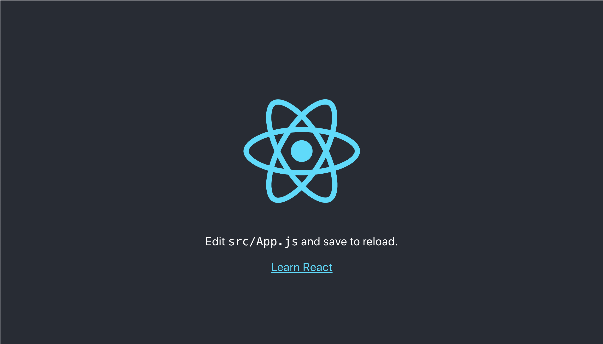

サーバはターミナル上で`control + c`すると停止できる．

### Reactの開発手順について
- `npm start`を実行した状態でファイルを編集すると自動的にコンパイルが行われ，最新の状態がブラウザ画面に反映される．
- `npm start`実行 -> vs codeでコード編集 -> ブラウザで動作確認 の繰り返し．
- ライブラリ追加時などはサーバを再起動しないと反映されないため．動作しない場合は`control + c`して再度`npm start`でサーバを起動する．

### Reactの大まかな仕組み

- アプリケーションは全て`public/index.html`上で実行される．
- 実行時には`src/index.js`が実行され，`App`コンポーネントが`index.html`上にマウントされる．
- 実際に画面に表示されるのは`App.js`内に記述された内容となる．
- この`App.js`から様々なコンポーネントを読み込むことでアプリケーションが動作する．

### メイン画面の編集と不要なファイルの削除

メインの画面は`App.js`であり，このファイルが`index.html`の`id=root`に描画される．

初期状態では`App.js`に不要な記述が含まれているため削除する．合わせて使用しないファイルも削除する．

`App.js`のファイル名を`App.jsx`に変更し，内容を以下のように編集する．

```jsx
// App.jsx
import React from 'react';

const App = () => {
  return (
    <div>
      <h1>books app</h1>
    </div>
  );
}
export default App;
```

以下のファイルを削除する．
- `src/App.css`
- `src/App.test.js`
- `src/logo.svg`

以下のコマンドで開発サーバを起動する．

```bash
$ npm start
```

ブラウザ画面を確認すると以下のようになっている．


### 【補足】jsとjsx
- js：Javascriptのファイル．
- jsx：React要素を生成するJavascriptの拡張．Reactではこちらを使うとたくさんいいことがある．

## コンポーネントの実装

ここから，実際にコンポーネントを実装してみる．

- `src`ディレクトリに`components`ディレクトリを作成する．
- `components`ディレクトリ内に`Booklist.jsx`を作成する．
- `Booklist.jsx`に以下の内容を記述する．

```jsx
// Booklist.jsx
import React from 'react';

const Booklist = props => {
  return (
    <div>
      <p>this is book list component</p>
    </div>
  );
}
export default Booklist;
```

### 【解説】

コンポーネントの作成

- コンポーネントには「classコンポーネント」と「関数コンポーネント」の2種類が存在する．
- classコンポーネントは「状態を持つことができる（ステートフル）」という特徴があるが，関数コンポーネントでも「react hooks」という技術を使うことで同様の振る舞いを実現することができる．
- 「state」というのはコンポーネント自体が持つ値であり，他にコンポーネントが外から受け取る「props」が存在する．
- コンポーネント作成の際には，できるだけstateを持たないよう設計すると動作確認が楽になるだけでなく，バグの生まれる可能性も低減できる．
- そのため，本記事では可能な限り関数コンポーネントを使用してアプリケーションを構築する．

コンポーネントの構造

- `import ...`は必要なライブラリを読み込む．
- 関数`Booklist`は呼び出し元のコンポーネントから`props`を受け取り，`<div>`要素を出力する．
- `export default Booklist`とすることで，他のコンポーネントから`import`で呼び出せるようにしている．

## コンポーネントの呼び出し（1）

`Booklist`コンポーネントを作成したので，`App`コンポーネントから呼び出してみる．

`App.jsx`を以下のように編集する．

```jsx
// App.jsx
import React from 'react';
import Booklist from './components/Booklist';	// 追加（コンポーネントのimport）

const App = () => {
  return (
    <div>
      <h1>react app</h1>
      <Booklist />	// 追加（コンポーネントを出力）
    </div>
  );
}
export default App;
```

ブラウザで表示を確認すると以下のようになっている．

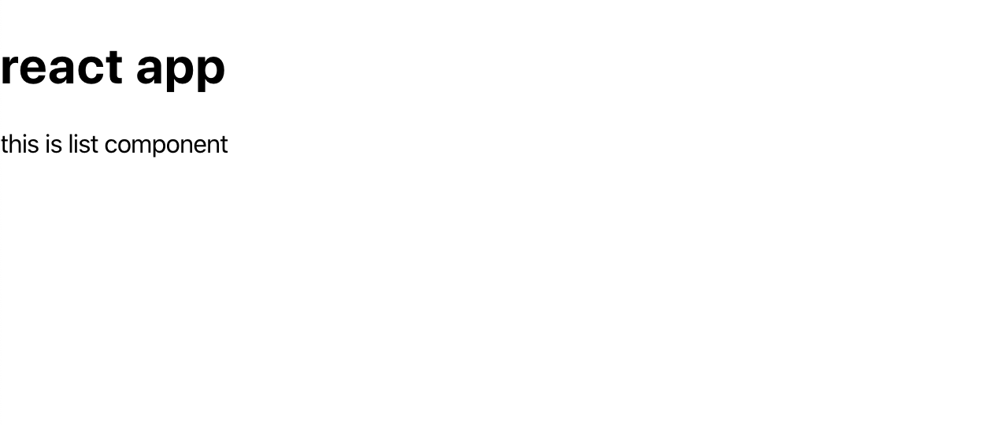

また，検証画面を確認すると，以下のようにBooklistコンポーネントが読み込まれていることがわかる．

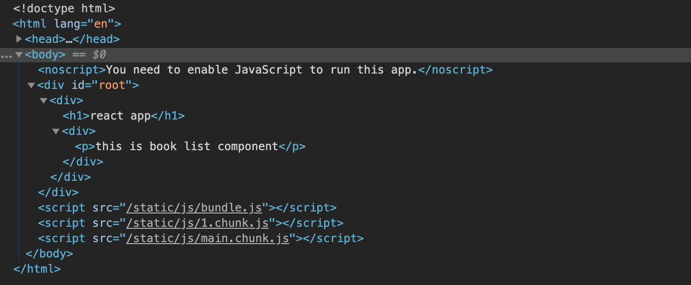


## コンポーネントの呼び出し（2）

呼び出すコンポーネントを2つにしてみる．

`App.jsx`を以下のように編集する．

```jsx
// App.jsx
import React from 'react';
import Booklist from './components/Booklist';

const App = () => {
  return (
    <div>
      <h1>react app</h1>
      <Booklist />
      <Booklist />	// 追加（コンポーネント2つめ）
    </div>
  );
}
export default App;
```

ブラウザ画面で，`Booklist`コンポーネントが2つ表示されていることを確認しよう．

このように，作成したコンポーネントは複数使用することもできる．

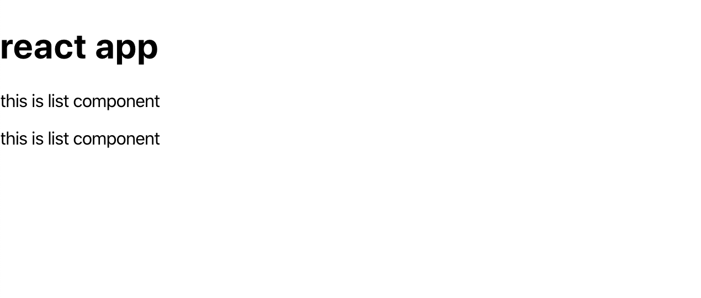


## `props`の活用

`props`は呼び出し元のコンポーネント（親コンポーネント）から呼び出されたコンポーネント（子コンポーネント）に渡されるデータの塊である．

### `props`でデータを渡す

実際に`App`コンポーネントから`Booklist`コンポーネントに文字列のデータを渡してみよう．

`App.jsx`を以下のように編集する．

```jsx
// App.jsx
import React from 'react';
import Booklist from './components/Booklist';

const App = () => {
  const languages = ['React', 'Vue', 'Angular'];	// 追加
  return (
    <div>
      <h1>react app</h1>
      <Booklist                 // このあたり編集
        language={languages[0]} // このあたり編集
      />
      <Booklist />
    </div>
  );
}
export default App;
```

ここでは，「`App`コンポーネントから`Booklist`コンポーネントに」「`language`という名前で」「`languages[0]`の値」を渡している．

タグ内に変数を入れるときは`{}`を使用する．

### `props`でデータを受け取る

続いて，値を渡される`Booklist.jsx`を以下のように編集する．

```jsx
// Booklist.jsx
import React from 'react';

const Booklist = props => {
  return (
    <div>
      <p>this is {props.language} list component</p>  // ここを編集
    </div>
  );
}
export default Booklist;
```

ブラウザで画面を確認すると以下のような状態になる．

1つめのコンポーネントは`React`の文字列が追加いるが，2つめのコンポーネントには追加されていない．なぜだろうか．

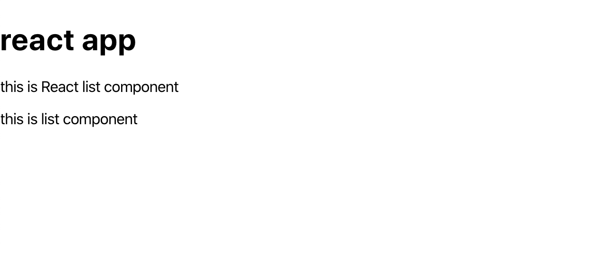

1つめのコンポーネントには`App.jsx`で`language={languages[0]}`が記述されているが，2つめでは記述されていない．そのため，2つめのコンポーネントでは`props`が空の状態となっており表示が追加されない．

### 追加！

2つめのコンポーネントにもデータを渡すには次のように`App.jsx`を編集する．

（ついでにコンポーネントを追加！）

```jsx
// App.jsx
import React from 'react';
import Booklist from './components/Booklist';

const App = () => {
  const languages = ['React', 'Vue', 'Angular'];
  return (
    <div>
      <h1>react app</h1>
      <Booklist
        language={languages[0]}
      />
      <Booklist
        language={languages[1]} // ここは'Vue'を渡す
      />
      <Booklist
        language={languages[2]} // ここは'Angular'を渡す
      />
    </div>
  );
}
export default App;
```

こうなる！

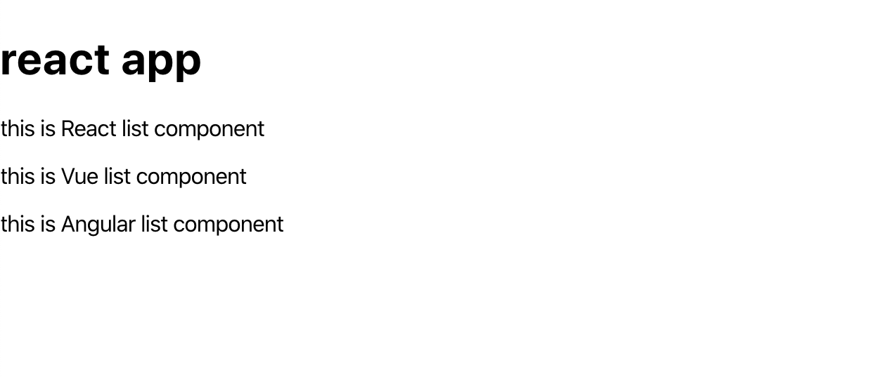

このように，関数コンポーネントは`props`を受け取り，要素を返す関数となる．実装するときは「何を入力して」「何を出力するのか」を意識すると（多分）混乱せずすすめることができる．


## コンポーネントでページを分ける（react-router）

実際のwebアプリケーションでは，処理ごとにページを分けて行いたい場合が多い．

ここまでの実装では，1つのページに全てのコンポーネントを表示していたが，本項ではコンポーネントを別ページで表現する．そのままの記述ではページ遷移が行えないので，新しく`react-router`のライブラリをインストールする．

### `react-router`のインストール

ターミナルで**作業ディレクトリにいることを確認**し，下記コマンドを実行する．

```bash
$ npm install react-router-dom
```

### 【解説】ルーティング
- 通常，Reactでwebアプリケーションを実装すると，コンポーネントが切り替わってもURLは変化しない．
- この2つを関連づけて，URLからアプリ内の特定のコンポーネントにアクセスできるようにしたり，逆にアプリ内での状態変化をURLに反映させたりすることをルーティングと呼ぶ．
- ルーティングしておくと，ブラウザの戻るボタンで戻ったり，URLを打って特定のページに直接アクセスできたりするのでいい感じになる．

### ルーティングの定義

`react-router`の機能を用いてルーティングを実装する．

`App.jsx`を以下のように編集する．

```jsx
// App.jsx
import React from 'react';
import Booklist from './components/Booklist';
import { BrowserRouter, Route, Link } from 'react-router-dom';  // 追加

const App = () => {
  const languages = ['React', 'Vue', 'Angular'];
  return (
    <BrowserRouter>   // 追加（ルーティングは<BrowserRouter>の中で行う）
      <div>
        <h1>react app</h1>
        <Route exact path='/' component={Booklist} />   // 編集
        <Route path='/vue' component={Booklist} />      // 編集
        <Route path='/angular' component={Booklist} />  // 編集
      </div>
    </BrowserRouter>  // 追加
  );
}
export default App;
```

- `<BrowserRouter>`の中に`<Route>`を置き，`path`に対応させたいURLを，`component`に描画したいコンポーネントを渡す．
- `exact`を設定しないと`path`が入力したURLに前方一致していれば描画されるため（全部`/`で認識されてしまう），`path='/'`には`exact`を設定している．
- この時点では，各コンポーネントに`props`を渡していないため，URLを変更しても表示は変化しない．

### ルーティングしながらpropsを渡す

- せっかく`props`でデータを渡していたので，ルーティング使用時も`props`を活用したい．
- しかし，` component={Booklist}`のように記述するとpropsを記述する場所がない．
- `render`を使用すると`props`を使用できる．

`App.jsx`を以下のように編集する．

```jsx
// App.jsx
import React from 'react';
import Booklist from './components/Booklist';
import { BrowserRouter, Route, Link } from 'react-router-dom';  // 追加

const App = () => {
  const languages = ['React', 'Vue', 'Angular'];
  return (
    <BrowserRouter>
      <div>
        <h1>react app</h1>
        <Route exact path='/' render={props => <Booklist language={languages[0]} />} />   // 編集
        <Route path='/vue' render={props => <Booklist language={languages[1]} />} />    // 編集
        <Route path='/angular' render={props => <Booklist language={languages[2]} />} />    // 編集
      </div>
    </BrowserRouter>
  );
}
export default App;
```

こうするとルーティングとpropsを併用できる．

ブラウザで`localhost:3000/vue`などとURLを入力して表示を確認しよう．

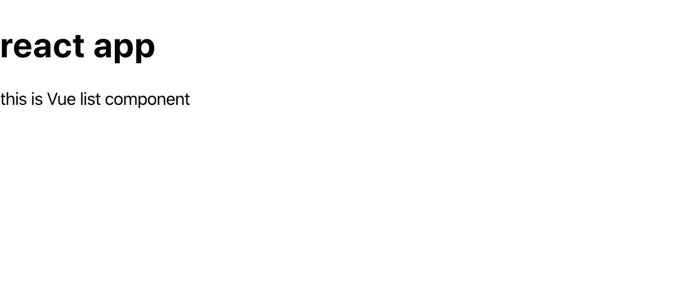

### リンクを貼る

- 毎回URL入力はダルい．
- せっかくルーティングを実装したので，リンクを張ってブラウザ上で移動できるようにしたい．
- `react-router`の`Link`機能を使うと簡単にリンクを作成できる．

`App.jsx`を以下のように編集する．

```jsx
// App.jsx
import React from 'react';
import Booklist from './components/Booklist';
import { BrowserRouter, Route, Link } from 'react-router-dom';

const App = () => {
  const languages = ['React', 'Vue', 'Angular'];
  return (
    <BrowserRouter>
      <div>
        <h1>react app</h1>
        <ul>        // この辺から追加
          <li><Link to='/'>React</Link></li>
          <li><Link to='/vue'>Vue</Link></li>
          <li><Link to='/angular'>Angular</Link></li>
        </ul>
        <hr />      // この辺まで追加
        <Route exact path='/' render={props => <Booklist language={languages[0]} />} />
        <Route path='/vue' render={props => <Booklist language={languages[1]} />} />
        <Route path='/angular' render={props => <Booklist language={languages[2]} />} />
      </div>
    </BrowserRouter>
  );
}
export default App;
```

`<Link>`タグの`to`部分に移動したいURLを書いておくと，`<a>`タグのようにリンクしてくれる．

ブラウザ画面で移動できることを確認しよう．

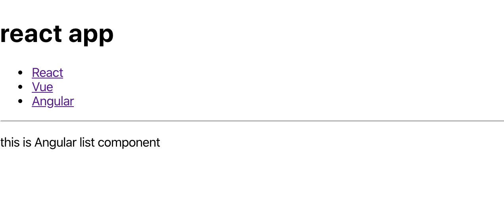


## 子コンポーネントに関数を渡す

ページごとにコンポーネントを表示できたので，それぞれのページでキーワードから本のデータを取得したい．

全ての子コンポーネントで実行する処理は同じなので，`App.jsx`で関数を定義して子コンポーネントに渡してあげれば効率が良い．

### 関数の定義を`props`の1つとして渡す

`App.jsx`を以下のように編集する

```jsx
// App.jsx
import React from 'react';
import Booklist from './components/Booklist';
import { BrowserRouter, Route, Link } from 'react-router-dom';

// 入力値に`books`を追加して出力するシンプルな関数を定義
const getDataFromAPI = keyword => {
  return `${keyword} books`;
}

const App = () => {
  const languages = ['React', 'Vue', 'Angular'];
  return (
    <BrowserRouter>
      <div>
        <h1>react app</h1>
        <ul>
          <li><Link to='/'>React</Link></li>
          <li><Link to='/vue'>Vue</Link></li>
          <li><Link to='/angular'>Angular</Link></li>
        </ul>
        <hr />
        <Route
          exact
          path='/'
          render={
            props =>
              <Booklist
                language={languages[0]}
                getData={keyword => getDataFromAPI(keyword)}  // getDataという名前で関数を渡す
              />}
        />
        <Route path='/vue' render={props => <Booklist language={languages[1]} />} />
        <Route path='/angular' render={props => <Booklist language={languages[2]} />} />
      </div>
    </BrowserRouter>
  );
}
export default App;
```

ここでは「`getData`」という名前で「keywordを入力するとgetDataFromApi(keyword)を実行する関数」を「`Booklist`コンポーネント」に渡している．

### `props`からの受け取りと関数の実行

続いて，`Booklist`コンポーネントで関数を受け取って実行する．

子コンポーネントで，読み込み時に渡された関数を実行してその結果を要素に反映する．

```jsx
// Booklist.jsx
import React from 'react';

const Booklist = props => {
  const result = props.getData?.(props.language); // `?`を使用することで，`getData`が存在する場合のみ関数を実行できる
  return (
    <div>
      <p>this is {result} list component</p>
    </div>
  );
}
export default Booklist;
```

ブラウザで確認すると「react books」のように表示がされていることがわかる．`Vue`と`Angular`の部分は関数を渡していないので表示がされない状態でOK．


ここまでうまく行ったら，`App.jsx`内の`<Route>`要素残り2つも同様に追記しよう．

```jsx
// App.jsx
import React from 'react';
import Booklist from './components/Booklist';
import { BrowserRouter, Route, Link } from 'react-router-dom';

const getDataFromAPI = keyword => {
  return `${keyword} books`;
}

const App = () => {
  const languages = ['React', 'Vue', 'Angular'];
  return (
    <BrowserRouter>
      <div>
        <h1>react app</h1>
        <ul>
          <li><Link to='/'>React</Link></li>
          <li><Link to='/vue'>Vue</Link></li>
          <li><Link to='/angular'>Angular</Link></li>
        </ul>
        <hr />
        <Route
          exact
          path='/'
          render={
            props =>
              <Booklist
                language={languages[0]}
                getData={keyword => getDataFromAPI(keyword)}  // getDataという名前で関数を渡す
              />}
        />
        <Route
          path='/vue'
          render={props =>
            <Booklist
              language={languages[1]}
              getData={keyword => getDataFromAPI(keyword)}
            />}
        />
        <Route
          path='/angular'
          render={props =>
            <Booklist
              language={languages[2]}
              getData={keyword => getDataFromAPI(keyword)}
            />}
        />
      </div>
    </BrowserRouter>
  );
}
export default App;
```

ブラウザで操作し，うまくいけばOK．これで親コンポーネントで定義した関数を子コンポーネントに渡すことができた．


## httpリクエストの実装

- 子コンポーネントに関数が渡せたが，現状では入力値に文字列を追加して出力するだけの関数である．
- そこで，指定したキーワードでGoogle books APIからデータを取得する処理に変更する．
- httpリクエストには`axios`を使用する．

### `axios`ライブラリのインストール

下記コマンドでインストール．

```bash
$ npm install axios
```

エラーがでなければOK．

### リクエスト関数を実装

`App.jsx`の`getDataFromAPI`関数を編集する．

```jsx
// Api.jsx
import axios from 'axios';	// 追加
...
// 関数の内容を編集
const getDataFromAPI = async keyword => {
  const requestUrl = 'https://www.googleapis.com/books/v1/volumes?q=intitle:'
  const result = await axios.get(`${requestUrl}${keyword}`);
  return result;
}
...
```

※この記述だけでは動きません！！

### コンポーネントで関数を実行する（useState, useEffect）

子コンポーネントで`getDataFromAPI`関数を実行したいが，以下2つの問題がある．

- 子コンポーネントは関数であるため，取得したデータを保持できない．
- データ更新時にレンダリングが再実行されるため，APIリクエストが無限ループになる．

前者の問題には`useState`，後者の問題には`useEffect`という機能を使うことで対処できる．

（`useState`と`useEffect`はReactの標準の機能なのでインストールなどの作業は必要ない）

`Booklist.jsx`を下記のように編集する．

```jsx
// Booklist.jsx
import React, { useState, useEffect } from 'react'; // 追加

const Booklist = props => {
  const [bookData, setBookData] = useState(null);   // ここから追加
  useEffect(() => {
    const result = props.getData?.(props.language).then(response => setBookData(response));
  }, [props])                                       // ここまで追加
  return (
    <div>
      <p>this is {JSON.stringify(bookData)} list component</p>	// 編集（オブジェクトはそのまま表示できないのでJSON.stringify()する）
    </div>
  );
}
export default Booklist;
```

ブラウザで確認すると，以下のように取得したデータが文字列で表示される．

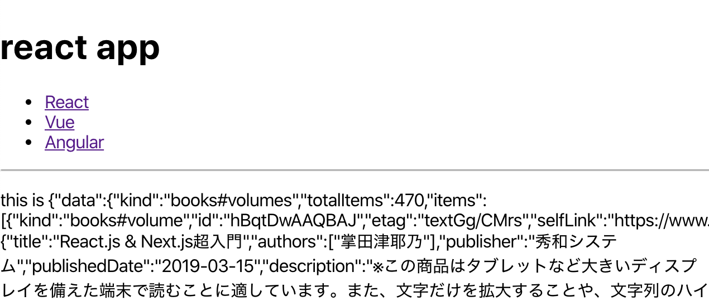

### 【解説】useState
- useStateは関数コンポーネントが値（今回はAPIから取得したデータ）を保持するための機能．
- `const [bookData, setBookData] = useState(null);`の`bookData`が変数名，`setBookData`がデータを更新するための関数，`useState(null)`の`null`が`bookData`の初期値となる．
- `setBookData(最新の値)`のように記述することで，`bookData`の値が最新の値に更新される．
- `bookData`に保存した内容を表示したいときなどは通常の変数のように扱えばOK．

### 【解説】useEffect
- 非同期通信を扱うための機能．
- Reactでは，コンポーネント内でデータの更新があると再レンダリングされるため，APIからデータを取得すると毎回レンダリングが発生して無限ループとなってしまう．
- useEffectはレンダリングを制限し，特定の値が更新されたときのみ処理が実行されるようにしてくれる機能．
- 書式は以下のような感じ．

```jsx
  useEffect(() => {
    実行したい処理
  }, [ここに書いた値（今回はprops）が更新されたときのみ，上の{}内が実行される．ここに値を書くときは配列で書く])
```


## 表示を整える

現状では取得したデータを全て文字列で表示しているだけなので，書籍のタイトルがリスト表示されるよう整える．

booksDataから必要なデータを取り出して`map()`関数で`<li>`タグをつくる．

```jsx
// Booklist.jsx
import React, { useState, useEffect } from 'react';

const Booklist = props => {
  const [bookData, setBookData] = useState(null);
  useEffect(() => {
    const result = props.getData?.(props.language).then(response => setBookData(response));
  }, [props])
  return (
    <div>
      <ul>
        {bookData.data.items.map(x => <li>{x.volumeInfo.title}</li>)}
      </ul>
    </div>
  );
}
export default Booklist;
```

ブラウザで表示を確認するとエラーになる．

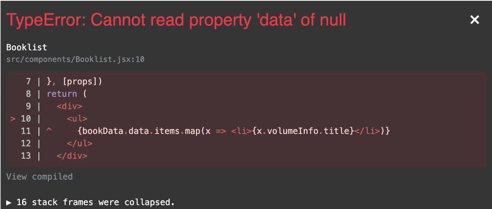

このエラーの原因は，まだAPIからデータを取得していない状態でレンダリングしようとして`map()`関数が実行されているためである．

三項演算子を使用して，`bookData`の有無で表示を切り替えることで回避できる．

- `bookData`が`null`の場合はローディング中のメッセージを表示．
- データが取得できたらリスト表示に切り替え．

```jsx
// Booklist.jsx
import React, { useState, useEffect } from 'react';

const Booklist = props => {
  const [bookData, setBookData] = useState(null);
  useEffect(() => {
    const result = props.getData?.(props.language).then(response => setBookData(response));
  }, [props])
  return (
    <div>
      <ul>
        {     // このあたり編集
          bookData === null
            ? <p>now loading...</p>
            : bookData.data.items.map((x, index) => <li key={index}>{x.volumeInfo.title}</li>)
        }
      </ul>
    </div>
  );
}
export default Booklist;
```

このように表示されればOK！

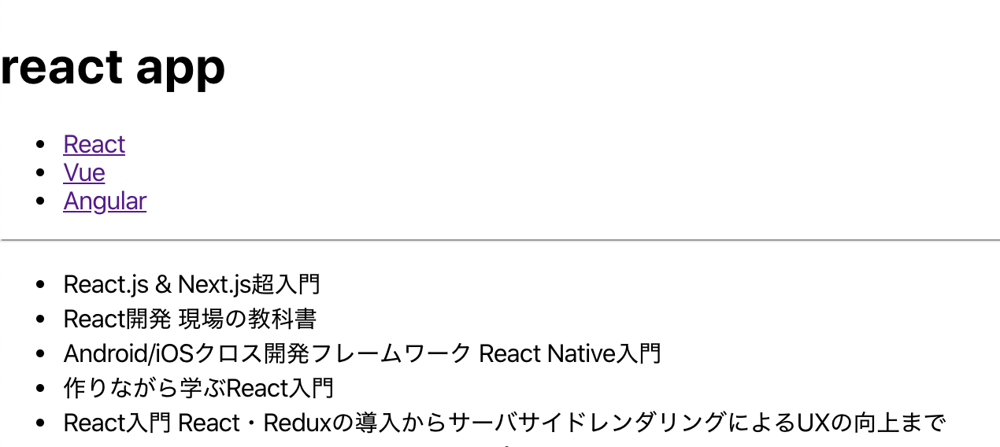

リンククリックするとリストも切り替わる挙動になっている（はず）．

今回はここまで( `･ω･)b


